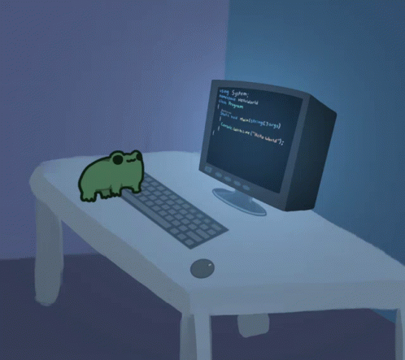

    <h3> Olá, aqui é Daniele Simas </h3>
    

 

<h3 align="center">Tecnologias que domínio</h3>
  

         
   
   
   

<h3 align="center">Tecnologias que conheço</h3>  

   
  
  
  
  
  
  
  
  
  
  
  

    

        
        
    

    <h3>Contatos</h3>
    

        
        
        
        
    

